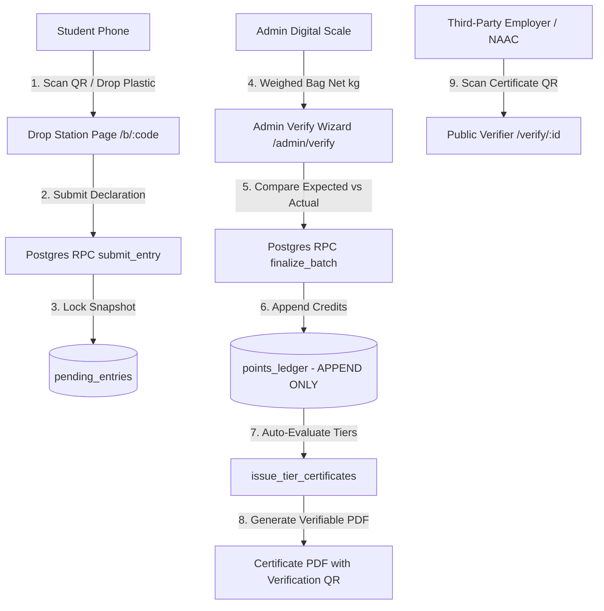

# Campus Plastic Credits: Technical Architecture

## 1. System Overview
The **Campus Plastic Credits Portal** is an operations and accounting platform designed for college campus plastic collection initiatives, branded for **Bisleri**. It bridges physical waste diversion with digital credentials:
- Physical drop stations with QR codes.
- Immediate student declaration with instant visual confirmation and undo grace window.
- Administrator scale weigh-in batch verification.
- Tamper-proof append-only ledger calculating lifetime points.
- Automated tier evaluation and verifiable PDF certificate issuance.

---

## 2. Component Architecture

---

## 3. Core Database Tables & Data Rules

1. **`campuses`**: Campus identity, default timezone (`Asia/Kolkata`), admin contact.
2. **`bins`**: Physical stations, unambiguous 8-character codes (`23456789ABCDEFGHJKMNPQRSTUVWXYZ`), GPS pins, status.
3. **`plastic_types`**: Baseline weights (integer grams), credit point values, icons.
4. **`student_profiles`**: Roll number, department, year, DPDP consent, 18+ gate.
5. **`entries`**: Dropped item declarations, immutable rate snapshots (`points_per_item_snapshot`, `avg_grams_snapshot`).
6. **`batches`**: Weighing sessions. Enforced with partial unique index `idx_one_open_batch_per_bin` (only one open batch per bin at a time).
7. **`points_ledger`**: **APPEND-ONLY**. Protected by SQL trigger `trg_points_ledger_append_only` which raises an exception on any `UPDATE` or `DELETE`.
8. **`certificates`**: Verifiable credentials, SHA256 fingerprints, issue date, status.
9. **`accounting_transactions`**: Recycler sales and campus logistics expenses (stored as integer paise).
10. **`audit_log`**: Tamper-proof record of every admin action with before/after JSON states.

---

## 4. Key Postgres RPC Functions

- `public_bin_lookup(p_code)`: Safe public bin status check returning only name, location, and status.
- `submit_entry(...)`: Locks student row, validates daily cap, snapshots rates, and inserts pending item declaration.
- `undo_entry(p_entry_id)`: Marks an unbatched pending drop as `cancelled` within the 5-minute grace window.
- `create_batch(p_bin_id, p_cutoff)`: Atomically locks all pending entries with `created_at <= p_cutoff` and binds them to a new batch.
- `finalize_batch(p_batch_id, p_actual_weight_g, ...)`: Verifies tolerance, marks batch finalized, credits points to the append-only ledger, and invokes `issue_tier_certificates`.
- `issue_tier_certificates(p_campus_id)`: Evaluates student lifetime points against tier thresholds and issues new verifiable certificates.
- `verify_certificate(p_certificate_no)`: Public verification endpoint returning masked student name ("Aditya K."), tier, campus, and item count.

---

## 5. Security & Privacy Guarantees

1. **Strict RLS:** Students can read and write only their own records (`auth.uid() = student_id`).
2. **Server-Only Secrets:** Supabase service-role keys are never exposed in client bundles.
3. **DPDP Compliance:** Collects minimal identifiable data; age-gated (18+); allows one-click full data export and irreversible anonymization.
4. **Public Privacy Protection:** Certificate verification masks full names and conceals student roll numbers, email addresses, and phone numbers.
